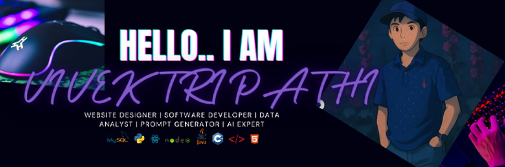

# 👋 Hi, I'm Vivek Tripathi

### 💻 Full-Stack Developer | 📊 Data Analyst | 🤖 AI Enthusiast

I build intelligent systems, data-driven dashboards, and scalable web applications that solve real-world problems.

---

## 🚀 About Me

* 🎓 B.Tech Graduate (Data Science)
* 💡 Passionate about **AI, Data Analytics, and Full-Stack Development**
* 🔬 Focused on building **real-world impactful projects**
* 📍 Based in India

---

## 🧠 Tech Stack

### 💻 Development

`Python` `Flask` `JavaScript` `HTML` `CSS` `React`

### 📊 Data & AI

`Pandas` `NumPy` `Scikit-learn` `TensorFlow` `Power BI`

### 🗄️ Databases & Tools

`MySQL` `PostgreSQL` `Git` `Docker` `AWS`

---

## 🏆 Featured Projects

### 🧠 Medical Imaging System – Pneumonia Detection

AI-powered system for detecting pneumonia from chest X-ray images using deep learning.

---

### 🌾 Project Samarth – Intelligent Agricultural Insights Platform

Smart agriculture platform providing crop recommendations and data-driven insights.

---

### 🎮 EmpireX – Gaming Solution Platform

Full-stack MMO strategy web platform with real-time chat and multiplayer features.

---

### 📊 Customer Churn Prediction Dashboard

Machine learning dashboard predicting customer churn with 85%+ accuracy.

---

### 🛒 E-Commerce Sales Analysis Dashboard (Power BI)

Interactive dashboard analyzing sales, profit, and customer trends.

---

### 🏥 Blood Bank Management System

System for managing donors, blood inventory, and requests efficiently.

---

### 🌐 3D Animated Flask Portfolio Website

Modern portfolio with authentication and 3D UI design.

---

## 📊 GitHub Stats

  
  

---

## 🌐 Connect With Me

* 💼 LinkedIn: https://linkedin.com/in/yourprofile
* 🌐 Portfolio: https://yourportfolio.com
* 📧 Email: [vivek.tripathi@gmail.com](mailto:vivek.tripathi@gmail.com)

---

## ⚡ What I Focus On

* Building **AI-powered applications**
* Creating **data-driven dashboards**
* Developing **scalable web systems**
* Solving **real-world problems using technology**

---

## 🚀 Motto

> “I turn data into decisions and code into impactful solutions.”

---
