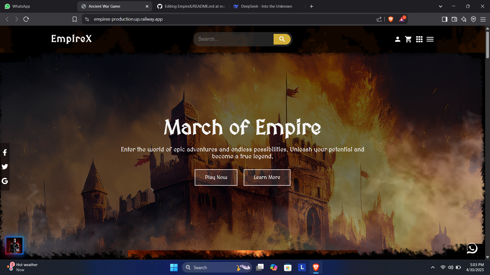
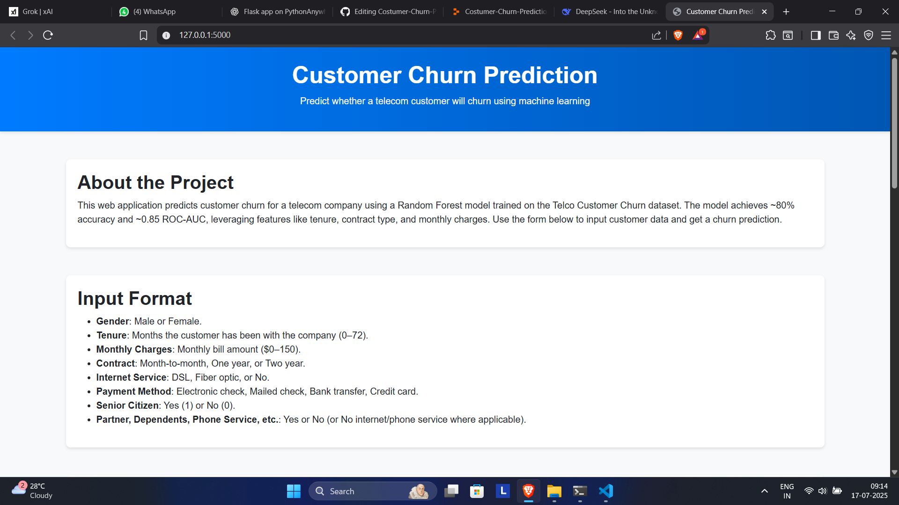

  

  <h1>
    
  </h1>

  

    Building intelligent systems, scalable web platforms, and data-driven solutions.
  

  

    
    
  

---

## 🚀 Tech Stack

---

## 🏆 Featured Projects

---

### 🧠 Medical Imaging System – Pneumonia Detection

🔗 https://huggingface.co/spaces/vivektri9500/medical_imagning

AI-powered deep learning system to detect pneumonia from chest X-rays.

* CNN-based model for medical image classification
* Real-time prediction via web interface
* Deployed on Hugging Face Spaces

---

### 🌾 Project Samarth – Intelligent Agricultural Insights

🔗 https://samarth72.pythonanywhere.com/

AI-based predictive system for smart farming decisions.

* Crop recommendation using ML models
* Uses environmental & soil parameters
* Data-driven agriculture insights

---

### 🎮 EmpireX – MMO Gaming Platform

🔗 https://empirex.onrender.com/

Full-stack multiplayer strategy platform inspired by *March of Empires*.

* Real-time chat (WebSockets)
* PayPal payment integration
* Leaderboard + Admin Panel
* Community-driven gaming ecosystem

---

### 📊 Customer Churn Prediction Dashboard

Machine learning dashboard to predict customer churn with 85%+ accuracy.

* Multiple ML models (RF, SVM, Logistic)
* Data visualization + insights
* Business-focused predictions

---

### 🛒 E-Commerce Sales Dashboard (Power BI)

🔗 https://github.com/Vivek-Tripathi00/E-commerce-analysis

Interactive dashboard analyzing sales, profit, and customer behavior.

* KPI-driven insights
* Advanced DAX & Power Query
* Business intelligence use case

---

### 🏥 Blood Bank Management System

Healthcare system to manage donors, blood inventory, and requests.

* Efficient database management
* Real-time availability tracking
* Practical healthcare application

---

### 🌐 3D Animated Flask Portfolio

🔗 https://vivektripathi.pythonanywhere.com

Modern interactive portfolio with authentication system.

* 3D UI + animations
* Login / Signup system
* Responsive design

---

## 📊 GitHub Stats

---

## ⚡ What I Do

* 🧠 Build AI-powered systems
* 📊 Create data-driven dashboards
* 🌐 Develop full-stack applications
* 🚀 Solve real-world problems with technology

---

## 🚀 Motto

> “I turn data into decisions and code into impactful solutions.”

---
