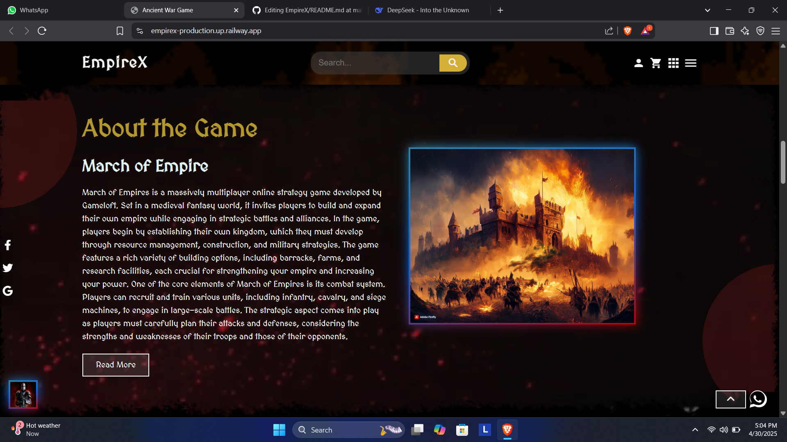

<div align="center">
  
  
  <!-- Animated 3D Title -->
  <h1 align="center"> 
    
  </h1>

  <!-- 3D Social Badges -->
  <div align="center">
    <a href="https://linkedin.com/in/yourprofile">
      
    </a>
    <a href="https://vivektripathi.dev">
      
    </a>
    <a href="mailto:vivek.tripathi@gmail.com">
      
    </a>
  </div>
</div>

---

## 🚀 **Tech Stack** 

<!-- 3D Tech Stack Cards -->
<div align="center">
  <table>
    <tr>
      <td align="center" width="150">
        
        <br>
        <strong>React</strong>
      </td>
      <td align="center" width="150">
        
        <br>
        <strong>Node.js</strong>
      </td>
      <td align="center" width="150">
        
        <br>
        <strong>Python</strong>
      </td>
      <td align="center" width="150">
        
        <br>
        <strong>Flask</strong>
      </td>
    </tr>
    <tr>
      <td align="center" width="150">
        
        <br>
        <strong>PostgreSQL</strong>
      </td>
      <td align="center" width="150">
        
        <br>
        <strong>Power BI</strong>
      </td>
      <td align="center" width="150">
        
        <br>
        <strong>Docker</strong>
      </td>
      <td align="center" width="150">
        
        <br>
        <strong>AWS</strong>
      </td>
    </tr>
  </table>
</div>

---

## 📊 **GitHub Analytics** 

<div align="center">
  <!-- 3D Stats Cards -->
  <a href="https://github.com/Vivek-Tripathi00">
    
    
  </a>
  
</div>

---

## 🆠**Featured Projects** 

<!-- 3D Project Cards -->
<div align="center">
  <table>
    <tr>
      <td width="50%">
        <h3 align="center">💬 Real-Time Chat System</h3>
        <div align="center">
          <a href="https://github.com/Vivek-Tripathi00/chat-app">
            
          </a>
          <p>WebSocket + React + Flask | End-to-end encrypted</p>
        </div>
      </td>
      <td width="50%">
        <h3 align="center">📝 AI Question Generator</h3>
        <div align="center">
          <a href="https://github.com/Vivek-Tripathi00/question-paper-generator">
            
          </a>
          <p>Python + NLP + SQL | Automated exam papers</p>
        </div>
      </td>
    </tr>
    <tr>
      <td width="50%">
        <h3 align="center">🌡️ AQI Analytics Dashboard</h3>
        <div align="center">
          <a href="https://github.com/Vivek-Tripathi00/aqi-analysis">
            
          </a>
          <p>Power BI + Python | Real-time air quality data</p>
        </div>
      </td>
      <td width="50%">
        <h3 align="center">🎮 Gaming E-Commerce</h3>
        <div align="center">
          <a href="https://github.com/Vivek-Tripathi00/gaming-empire">
            
          </a>
          <p>MERN Stack | Payment integration</p>
        </div>
      </td>
    </tr>
  </table>
</div>
## 🆠**Featured Projects** 

### 📊 E-commerce Sales Analysis Dashboard | Power BI 💼
> Mastering Business Decisions through Data Insights

[](https://github.com/Vivek-Tripathi00/E-commerce-analysis)
[](https://github.com/Vivek-Tripathi00/E-commerce-analysis)
[](https://github.com/Vivek-Tripathi00/E-commerce-analysis)

🎯 **Overview**  
Dive into a real-world **E-commerce dataset** using Power BI, where I uncover crucial insights such as profit trends, top-performing categories, and customer behavior patterns.  
This interactive dashboard exemplifies advanced **data modeling**, **ETL**, and **storytelling** using **Power Query** and **DAX**, focusing on **KPI-driven visuals** and actionable insights.

📌 **Key Highlights**  
- 💰 Total Sales: `438K` | 📈 Profit: `37K` | 📦 Quantity Sold: `5615`
- 📍 State-wise and City-wise Performance
- 💳 Payment Mode Analysis: COD, UPI, EMI, Cards
- 🗂️ Category & Sub-category Profitability
- 📆 Monthly Profit Trends
- 🎯 KPI-Driven Visuals with Dynamic Filters (Quarter, State, Category)


🔗 **Project Repository**  
👉 [GitHub Repo: E-commerce Analysis](https://github.com/Vivek-Tripathi00/E-commerce-analysis)

---
<h1 align="center">🌐 3D Animated Flask Portfolio Website</h1>

<p align="center">
  
  
  
  
</p>


🔗 Live Demo
🚀 Experience it live here:
👉 https://vivektripathi.pythonanywhere.com

🎯 Hosted with ❤️ on PythonAnywhere

<p align="center">
✨ A visually stunning, responsive, and secure modern portfolio with Login & Signup built using Flask and enhanced with HTML/CSS/JS ✨
</p>

## 📸 Screenshots (Live Preview)

<p align="center">
  
  
  
</p>

---


---

## 🔥 Features at a Glance

✅ 3D Animated Modern Portfolio  
✅ Flask-based User Authentication (Login / Signup)  
✅ Eye-Catching UI + Smooth Animations  
✅ Clean Modular Code  
✅ Fully Responsive Design  
✅ Custom Styling and Python Backend Integration  

---

# 🏰 EmpireX - March of Empires 


> **A Medieval Fantasy MMO Strategy Game**
>
> ----
 <!-- Replace with your actual banner image -->

> **A Medieval Fantasy MMO Strategy Game**  
> Build your empire, forge alliances, and conquer the realm in this immersive multiplayer experience!

[](https://flask.palletsprojects.com/)
[](https://www.python.org/)
[](https://www.postgresql.org/)
[](https://empirex-production.up.railway.app/)

<div align="center">
  
</div>


🌐 Live Demo
Experience the game at:
https://empirex-production.up.railway.app/


## ✨ Features

<div align="center">
  
| Feature | Description |
|---------|-------------|
| 🏗️ **Empire Building** | Construct and upgrade various buildings to strengthen your kingdom |
| ⚔️ **Strategic Warfare** | Command diverse units in tactical battles with formations |
| 🤝 **Alliance System** | Form powerful alliances and dominate the realm together |
| 👑 **Faction Selection** | Choose from unique factions with special bonuses |
| 🏆 **Tournaments** | Compete in seasonal events for glory and rewards |
| 💬 **Real-time Chat** | Coordinate with allies using Flask-SocketIO |
| 🔐 **Secure Authentication** | Flask-Login and Bcrypt for secure user accounts |

</div>

## 🖼️ Screenshots

<div align="center">
  
  
  
</div>

## 🛠️ Tech Stack

### Backend
- **Framework**: Flask 3.0.2
- **Database**: PostgreSQL with Flask-SQLAlchemy 3.1.1
- **Authentication**: Flask-Login 0.6.3 + Flask-Bcrypt
- **Real-time**: Flask-SocketIO 5.3.6
- **Payments**: PayPal REST SDK 1.13.1
- **Email**: Flask-Mail 0.9.1
- **Environment**: python-dotenv 1.0.1

### Frontend
- HTML5, CSS3, JavaScript
- Responsive Design
- Interactive UI Elements

### Deployment
- **Platform**: Railway
- **WSGI Server**: Gunicorn 21.2.0
- **Async**: eventlet 0.33.3

## 🚀 Installation

pie
    title Game Achievements
    "Happy Players" : 150
    "Levels Completed" : 75
    "Awards Won" : 28
    "Achievements" : 100

gantt
    title Development Timeline
    dateFormat  YYYY-MM-DD
    section Core Features
    Authentication       :done,    auth1, 2024-01-01, 14d
    Empire Building      :done,    emp1, after auth1, 21d
    Combat System        :done,    comb1, after emp1, 28d
    section Multiplayer
    Alliance System      :active,  all1, 2024-02-20, 21d
    World Map            :         wmap1, after all1, 30d
    Tournaments          :         tour1, after wmap1, 14d

#  EmpireX - March of Empires 

 <!-- Replace with your animated banner -->

> "**Victory Awaits Those Who Dare**" - Prepare for the ultimate medieval strategy experience!

<div align="center">
  
[](https://empirex-production.up.railway.app/)
[](https://github.com/yourusername/EmpireX/releases)
[](https://discord.gg/your-invite-link)

</div>

## 🌟 Featured Gameplay

<div align="center">
  
</div>

## 🏆 Key Features

<div style="display: grid; grid-template-columns: repeat(auto-fit, minmax(300px, 1fr)); gap: 20px; margin: 30px 0;">

<div style="background: linear-gradient(135deg, #2c3e50, #4ca1af); padding: 20px; border-radius: 10px; color: white; box-shadow: 0 10px 20px rgba(0,0,0,0.2);">
<h3 align="center"> Empire Building</h3>
<ul>
<li>🏰 Construct 15+ unique buildings</li>
<li>🌾 Manage resources and economy</li>
<li>🔬 Research technologies</li>
<li>⚒️ Upgrade your stronghold</li>
</ul>
</div>

<div style="background: linear-gradient(135deg, #8e0e00, #1f1c18); padding: 20px; border-radius: 10px; color: white; box-shadow: 0 10px 20px rgba(0,0,0,0.2);">
<h3 align="center"> Warfare System</h3>
<ul>
<li>⚔️ 5 unit classes with rock-paper-scissors mechanics</li>
<li>🛡️ Formation-based combat</li>
<li>🔥 Special abilities and spells</li>
<li>🏹 Siege warfare mechanics</li>
</ul>
</div>

<div style="background: linear-gradient(135deg, #0f2027, #203a43, #2c5364); padding: 20px; border-radius: 10px; color: white; box-shadow: 0 10px 20px rgba(0,0,0,0.2);">
<h3 align="center"> Multiplayer</h3>
<ul>
<li>🤝 Alliance system with 50+ members capacity</li>
<li>🌍 Persistent world map</li>
<li>🏆 Weekly tournaments</li>
<li>💬 Real-time chat with SocketIO</li>
</ul>
</div>

</div>

## 🖼️ Screenshot Gallery

<div align="center">
  
| Dashboard | Battle Screen | Alliance View |
|-----------|---------------|---------------|
|  |  |  |
|  **Player Dashboard** |  **Battle Interface** |  **Alliance Management** |

</div>


---

## 📠**Latest Articles** 

<!-- Dynamic Blog Posts -->
<div align="center">
  <a href="https://yourblog.com/chat-app-tutorial">
    
  </a>
  <a href="https://yourblog.com/powerbi-vs-tableau">
    
  </a>
</div>

---


## 🧩 **What I Do** 

- 📊 **Data Whisperer** – Turning raw data into powerful decisions  
- 🎨 **UI Architect** – Crafting sleek, user-first interfaces  
- 🚀 **Growth Hacker** – Finding shortcuts to scale smarter

---

### 💡 Hobbies & Passions

| 🎯 Hobby           | 💬 Description                                 |
|-------------------|-----------------------------------------------|
| 📈 Data Viz        | Telling stories with insightful visuals       |
| 🧑‍🎨 UI Designing   | Creating immersive and responsive experiences |
| 🧠 Growth Hacking  | Finding the "why" behind every "what"         |

---

### 🚀 My Motto
> _"I turn data into decisions, and code into experiences. Whether it's crunching numbers or crafting sleek UIs, I'm building the future — one byte at a time."_ ⚡

---


## ⚙️ My Tech Stack & Tools

### Full Stack Development


### Databases & Cloud


### Data Science & Analytics


### Machine Learning & Deep Learning


### DevOps & Tools


### IDEs & Tools


### Other Tools


## 🵠**Now Playing** 

<div align="center">
  <!-- Dynamic Spotify Card -->
  [](https://open.spotify.com/user/yourspotifyid)
</div>

---

<div align="center">
  
  
</div>


# 🔮 Customer Churn Prediction Dashboard


> **"Prevent customer attrition before it happens with 85%+ accuracy!"**  
> An intelligent ML-powered desktop and web solution that predicts customer churn, built using Python, Scikit-learn, and Flask/Tkinter. Perfect for analysts, teams, and businesses wanting to proactively retain customers.

<div align="center">

[](https://www.python.org/)
[](https://flask.palletsprojects.com/)
[](https://scikit-learn.org/)
[](LICENSE)

</div>

---

## 🌟 Features

| Real-time Prediction | Explainable AI | Business Value |
|----------------------|----------------|----------------|
| 🧠 Predict churn risk instantly from uploaded CSVs or forms. <br> 🧪 Trained on Telco dataset with 85%+ accuracy. | 📊 SHAP values for transparency. <br> 🔍 See which features contribute to churn. | 📉 Cut acquisition costs. <br> 🔁 Improve retention. <br> 📈 Make smarter marketing decisions. |

---

## 🖥️ App Preview

<div align="center">
  
</div>

---

## 📊 Data Visualization

<p align="center">
  
  
</p>

---

## ⚙️ How It Works

1. **User uploads a CSV file**
2. **Selects the target column (churn / not churn)**
3. **Model trains multiple classifiers (Logistic Regression, Random Forest, SVM)**
4. **App selects best performing model (based on accuracy)**
5. **Displays results, metrics, and predictions in an interactive GUI**
6. **Saves the best model (`best_model.pkl`) for reuse**

---

## 🚀 Getting Started

### 🔧 Option 1: Run with Python (Recommended for developers)

```bash
# Step 1: Clone the repo
git clone https://github.com/yourusername/churn-dashboard.git
cd churn-dashboard

# Step 2: Create virtual env
python -m venv venv
venv\Scripts\activate  # Windows

# Step 3: Install dependencies
pip install -r requirements.txt

# Step 4: Run the app
python app.py
